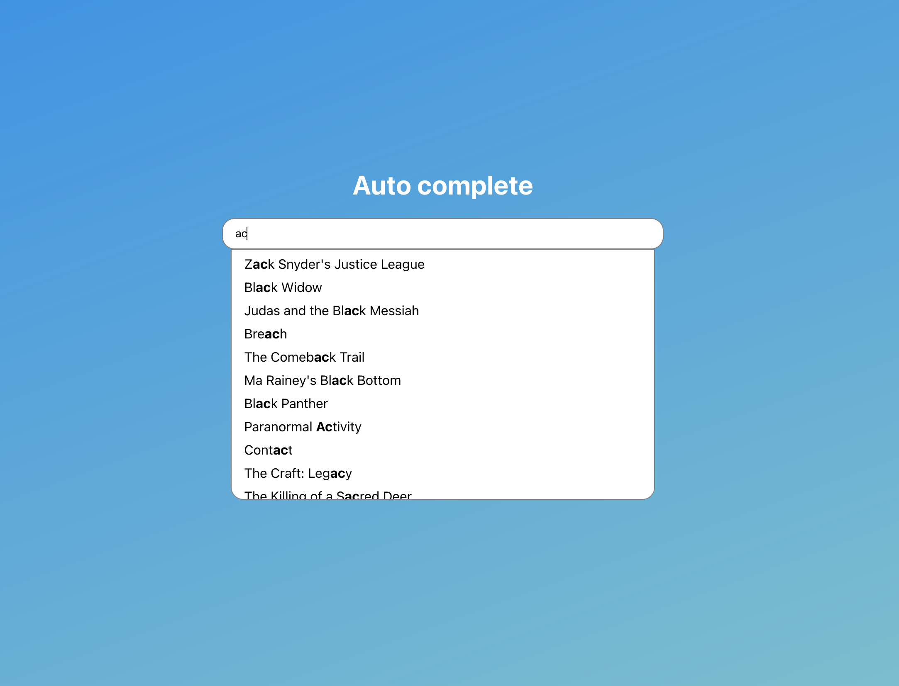

# Welcome to auto complete component

This project was bootstrapped with [Create React App](https://github.com/facebook/create-react-app).

## How to run

In the project directory, you can run:
``` 
    npm install
    npm start
```


Open [http://localhost:3000](http://localhost:3000) to view it in the browser.

The page will reload if you make edits.\

## Movies Mini Database
### `Movie API`

It was used the [Movies Mini Database](https://rapidapi.com/SAdrian/api/moviesminidatabase) to get the films by title.

# Auto Complete component API

### `options`

List of options 

### `inputValue`

Value of the input component

### `inputProps` and `optionProps`
Possible input that the developer can pass to child components

### `isDynamicOption`

When this option is false, the auto-complete component filters the options compared with the input value.
When this option is true, the auto-complete component assumes that the developer is handling the filter. (good to implement filters on API`s)

### `getOptionLabel()`

This option can be used to change to option label in the options list.

### `onInputChange()`

This event fire when input field change.
### `onOptionClick()`

this event fire when one option receive a click

## Example

```js
      <AutoComplete
        inputProps={{className: 'input'}}
        optionProps={{className: 'option'}}
        isDynamicOption
        options={options}
        getOptionLabel={(option: any) => option.title}
        inputValue={query}
        onInputChange={handleQueryChange}
        onOptionClick={handleItemClick}
      />
```


